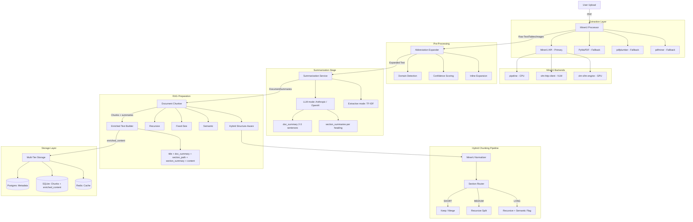

# Brain MVP - Complete Project Explanation

## System Overview

The Brain MVP is a high-precision **document processing and knowledge management system**. It transforms raw PDF documents into structured, searchable, and AI-ready data. Unlike simple text extractors, it implements a sophisticated pipeline designed for **Retrieval-Augmented Generation (RAG)**, featuring advanced chunking, context enrichment, and multi-tier storage.

---

## End-to-End Pipeline

The following diagram illustrates the complete journey of a document from upload to being "RAG-ready".



### 1. Extraction Phase

The **MinerU Processor** is the primary extraction engine with automatic fallback to legacy processors:

#### MinerU API (Primary)
- **Layout Detection**: DocLayout-YOLO for accurate document structure analysis
- **OCR Support**: PaddleOCR supporting 109 languages
- **Table Recognition**: Advanced table structure extraction
- **Formula Recognition**: UniMERNet for mathematical equations
- **Image Extraction**: Preserves embedded images with position data

#### Backend Options
| Backend | Description | Requirements | Status |
|---------|-------------|--------------|--------|
| `pipeline` | CPU-based processing with GPU-accelerated OCR | Any CPU/GPU | **Recommended** |
| `vlm-http-client` | Uses external VLM API (OpenAI-compatible) | VLM server | Works |
| `vlm-auto-engine` | Local GPU VLM processing | NVIDIA GPU | PyTorch conflict |
| `hybrid-auto-engine` | Next-gen local GPU processing | NVIDIA GPU | PyTorch conflict |
| `hybrid-http-client` | External VLM + local processing | VLM server | Works |

> **Note**: Due to PyTorch version conflicts between vLLM 0.6.1 (requires torch 2.4.0) and MinerU (installs torch 2.9.1), the VLM-based backends (`vlm-auto-engine`, `hybrid-auto-engine`) are currently broken. Use `pipeline` for reliable GPU-accelerated processing.

#### Fallback Processors
If MinerU is unavailable, the system falls back to:
- **PyMuPDF**: Fast and accurate for standard PDFs
- **pdfplumber**: Better for complex layouts and tables
- **pdfminer**: Final fallback for difficult or legacy PDFs

### 2. Abbreviation Expansion Phase
Before chunking, the system expands abbreviations and acronyms inline to improve RAG retrieval accuracy. For example, "API" becomes "API (Application Programming Interface)". This ensures that searches for either "API" or "Application Programming Interface" will find relevant content.

**How It Works:**
1. The `AbbreviationExpander` scans the document text for known abbreviations
2. Each abbreviation is looked up in domain-specific dictionaries
3. If confidence exceeds the threshold, the expansion is inserted inline
4. Both the original text and expanded text are preserved for comparison

**Supported Domains:**
- **Technical**: API, SQL, HTTP, HTML, CSS, JSON, REST, SDK, etc.
- **Academic**: NLP, ML, AI, PhD, GPA, etc.
- **Business**: CEO, CFO, ROI, KPI, B2B, etc.
- **Medical**: MRI, CT, ICU, ER, etc.
- **General**: USA, UK, NASA, FBI, etc.

**Features:**
- **Domain-Aware Detection**: Recognizes abbreviations from multiple domains simultaneously
- **Confidence Scoring**: Only expands when confidence exceeds threshold (default: 0.7)
- **Inline Expansion**: Preserves readability by keeping the abbreviation with expansion in parentheses
- **Persistence**: Expansion data is stored in the database and retrievable via API
- **Extensible Database**: Custom abbreviations can be added via `data/abbreviations.json`

**API Endpoint:**
```bash
# Get all abbreviation expansions for a document
curl "http://localhost:8088/api/v1/documents/{document_id}/abbreviations"

# Response includes:
# - List of all expanded abbreviations with their domains and confidence scores
# - Original and expanded text for comparison
# - Processing timestamp
```

**Configuration:**
- `PROCESSING__ENABLE_ABBREVIATION_EXPANSION=true` (enabled by default)
- `PROCESSING__ABBREVIATION_CONFIDENCE_THRESHOLD=0.7`

### 3. Summarization Phase

The `SummarizationService` runs as a discrete, testable stage between abbreviation expansion and chunking. It produces a `DocumentSummaries` object that is passed into the chunker, so every chunk automatically carries context strings from both the document level and its own section.

**Why this matters for RAG:** A retrieval query like "what is the budget for Project X?" may land in a chunk that only says "The budget was approved in Q3." Without context, this chunk is ambiguous. With a doc summary attached, the embedding represents "This document covers Project X financial planning… the budget was approved in Q3" — a far stronger match.

**Two modes:**

| Mode | How it works | API calls |
|------|-------------|-----------|
| `llm` (default) | Sends doc + section text to Claude Haiku or OpenAI. Falls back to headings + head/tail excerpt for large docs. | Yes |
| `extractive` | Scores sentences with TF-IDF, picks top-N as summary. | No |

**What gets generated:**
- **`doc_summary`**: 2–3 sentence overview of the whole document — shared by every chunk.
- **`section_summaries`**: 1–2 sentence summary per heading section, only for sections exceeding `section_summary_min_tokens`. Smaller sections are skipped to save cost.

**Enriched embedding text** built per chunk before storage:
```
Document: {title}. Overall summary: {doc_summary}. Section: {section_path}. Section summary: {section_summary}. Content: {raw_text}
```

**Configuration:**
```bash
PROCESSING__SUMMARIZATION__ENABLED=false           # off by default
PROCESSING__SUMMARIZATION__MODE=llm                # or extractive
PROCESSING__SUMMARIZATION__API_PROVIDER=anthropic  # or openai
PROCESSING__SUMMARIZATION__MODEL_NAME=claude-haiku-4-5-20251001
PROCESSING__SUMMARIZATION__MAX_DOC_TOKENS_FOR_DIRECT_SUMMARY=8000
PROCESSING__SUMMARIZATION__SECTION_SUMMARY_MIN_TOKENS=200
```

**Module:** `src/docforge/postprocessing/summarizer.py`
**Schema:** `DocumentSummaries` in `src/docforge/postprocessing/schemas.py`
**Chunk fields added:** `ChunkData.doc_summary`, `ChunkData.section_summary`, `ChunkData.section_path`

### 4. Chunking Phase
Documents are split into manageable "chunks" using configurable strategies:
- **Recursive**: Respects natural boundaries like paragraphs and sentences.
- **Semantic**: Uses AI embeddings to find logical breaks in meaning.
- **Fixed-Size**: Standard token-based windows with overlap.
- **Hybrid Structure-Aware**: A multi-stage pipeline that leverages the document's heading/section structure for higher-fidelity chunking. Details below.

#### Hybrid Structure-Aware Chunking (`hybrid_chunking/`)
This is the newest and most advanced chunking strategy, purpose-built for documents processed by MinerU where rich structural metadata (headings, sections, page numbers) is available.

**How it works:**

1. **Document Normalization** (`MinerUDocumentNormalizer`): Converts `StandardizedDocumentOutput` into a `NormalizedDocument` — a hierarchical model with sections (H1-H6), paragraphs, and pre-split sentences. Page numbers and element IDs are preserved for traceability.

2. **Section Routing** (`SectionRouter`): Each section is classified by word count into one of three categories:
   | Category | Word Count | Strategy |
   |----------|-----------|----------|
   | **SHORT** | < 150 | Keep as single chunk, or merge with adjacent short sections |
   | **MEDIUM** | 150 – 800 | Recursive split at paragraph/sentence boundaries |
   | **LONG** | > 800 | Recursive split + flagged for future semantic refinement |

3. **Structure-Aware Recursive Chunking** (`StructureAwareRecursiveChunker`): Splits follow a strict boundary hierarchy — **Section → Paragraph → Sentence** — so chunks never straddle structural boundaries. Each chunk carries its heading breadcrumb path (e.g., "Introduction > Background > History") for context.

4. **Overlap & Linking**: Adjacent chunks receive configurable word overlap (default 50 words) for context continuity and are linked with previous/next relationships.

5. **Storage Adapter** (`HybridChunkStorageAdapter`): Converts `HybridChunkResult` objects into the format expected by `ChunkStorage`, preserving all hybrid-specific metadata (size category, boundary type, heading path, semantic refinement flag).

**Configuration** (`HybridChunkingConfig`):
```python
short_section_threshold: 150   # words — below this → SHORT
long_section_threshold: 800    # words — above this → LONG
target_chunk_size: 500         # words — ideal chunk size
max_chunk_size: 800            # words — hard upper limit
min_chunk_size: 50             # words — minimum viable chunk
chunk_overlap: 50              # words — overlap between adjacent chunks
```

Presets are available via `HybridChunkingConfig.for_short_documents()` and `HybridChunkingConfig.for_long_documents()`.

**Key features:**
- Heading path context (breadcrumb) attached to every chunk
- Adjacent short section merging to avoid micro-chunks
- Semantic refinement candidate flagging for long sections
- Full element ID and page number traceability back to MinerU output
- Previous/next chunk relationship linking

### 5. Context Enrichment Phase
To solve the "lost in translation" problem in RAG, each chunk is optionally enriched with document-level context. This provides the LLM with the "big picture" for every small piece of text, significantly improving retrieval accuracy.

> **Note:** When the Summarization Stage is enabled, the enriched embedding text built from summaries replaces the LLM context enrichment step — both ultimately populate the `enriched_content` column, but the summarization path is significantly cheaper (one LLM call per doc vs. one per chunk).

---

## 📡 API Usage & Integration

The system provides a comprehensive REST API for both document management and RAG operations.

### Core Endpoints

| Category | Method | Endpoint | Description |
|----------|--------|----------|-------------|
| **Upload** | `POST` | `/api/v1/documents/upload` | Upload PDF and start processing |
| **Status** | `GET` | `/api/v1/documents/{id}/status` | Check extraction/chunking progress |
| **Content** | `GET` | `/api/v1/documents/{id}/content` | Get full text (Text/JSON/Markdown) |
| **Abbreviations** | `GET` | `/api/v1/documents/{id}/abbreviations` | Get abbreviation expansions |
| **Chunks** | `GET` | `/api/v1/chunks/document/{id}` | Get all processed chunks for RAG |
| **Delete** | `DELETE` | `/api/v1/documents/{id}` | Permanent deletion of all data |

### Example: Upload and Retrieve Chunks

```bash
# 1. Upload a document
curl -X POST "http://localhost:8088/api/v1/documents/upload" -F "file=@report.pdf"

# 2. Get the chunks for your RAG application
curl "http://localhost:8088/api/v1/chunks/document/{document_id}"
```

---

## 🗄 Data Architecture

The system uses a specialized multi-database approach to ensure performance and scalability.

### 1. Metadata Storage (PostgreSQL)
Stores the high-level document information, lineage, and processing history.
- **Table**: `raw_document_register` (Original file info)
- **Table**: `document_lineage` (Version tracking)

### 2. Chunk Storage (SQLite/Postgres)
Stores the actual text segments, their embeddings, and enrichment content.
- **Table**: `document_chunks`
  - `original_content`: The raw text segment.
  - `enriched_content`: Full enriched embedding string (title + summaries + content), used by the vector store.
  - `chunk_metadata` (JSON): Index, strategy, token counts, plus `doc_summary`, `section_summary`, and `section_path` when summarization is enabled.

---

## Docker & Deployment

The system is fully containerized for "one-command" deployment with multiple profiles for different hardware configurations.

### Core Services
- **brain-mvp-app**: The FastAPI engine and processing logic.
- **brain-mvp-postgres**: Persistent storage for metadata.
- **brain-mvp-redis**: High-speed cache for background tasks.

### MinerU Service Profiles

| Profile | Command | Use Case |
|---------|---------|----------|
| Default | `docker compose up -d` | Core services only, uses fallback PDF processors |
| CPU | `docker compose --profile cpu up -d` | MinerU with CPU pipeline backend |
| GPU | `docker compose -f docker-compose.yml -f docker-compose.gpu.yml --profile gpu up -d` | MinerU with NVIDIA GPU acceleration |
| Mac Model Runner | `docker compose --profile mac-modelrunner up -d` | MinerU with Docker Model Runner |

#### GPU Profile Details
The GPU profile uses the `pipeline` backend with GPU-accelerated components:
- DocLayout-YOLO for layout detection
- PaddleOCR with GPU acceleration (109 languages)
- Table structure recognition
- Formula recognition (UniMERNet)

Tested configurations:
- RTX 3060 Ti (8GB VRAM) with `VLLM_GPU_MEMORY_UTILIZATION=0.85`
- RTX 3090/4090 (24GB VRAM) with default settings

### Environment Configuration
Key settings can be adjusted in `docker-compose.yml` or `docker-compose.gpu.yml`:
- `PROCESSING__DEFAULT_CHUNKING_STRATEGY`: Default strategy (recursive/semantic/hybrid).
- `PROCESSING__SUMMARIZATION__ENABLED`: Enable LLM/extractive summarization (`true`/`false`, default `false`).
- `PROCESSING__SUMMARIZATION__MODE`: `llm` or `extractive`.
- `ANTHROPIC_API_KEY`: Required for LLM summarization with Anthropic provider.
- `OPENAI_API_KEY`: Required for semantic chunking, context enrichment, or LLM summarization with OpenAI provider.
- `MINERU_API_URL`: MinerU service endpoint (default: `http://mineru-api:8080`).
- `MINERU_API_ENABLED`: Enable/disable MinerU API (`true`/`false`).
- `MINERU_BACKEND`: Backend type (pipeline, vlm-http-client, hybrid-http-client).
- `MINERU_SERVER_URL`: VLM server URL for vlm-http-client backend.
- `VLLM_GPU_MEMORY_UTILIZATION`: GPU memory usage (0.0-1.0, default 0.85 for 8GB cards).

### Mac-Specific Notes

Docker Desktop's Model Runner on macOS has limitations with vision/multimodal models. For VLM-based PDF processing on Mac, we recommend running a llama.cpp server directly on the host with the mmproj file explicitly loaded. See [`KNOWN_ISSUES.md`](KNOWN_ISSUES.md) for detailed instructions.

---

## Security & Management

- **Individual Deletion**: Users can delete specific documents via the Web UI or API. This triggers a cascading delete across all databases (Metadata, Chunks, and Versions).
- **CORS Enabled**: The API is open for integration with any external frontend or service.
- **Interactive Docs**: Full API documentation is available at `http://localhost:8088/docs`.

**The Brain MVP is designed to be the "intelligent bridge" between your raw documents and your AI applications.**