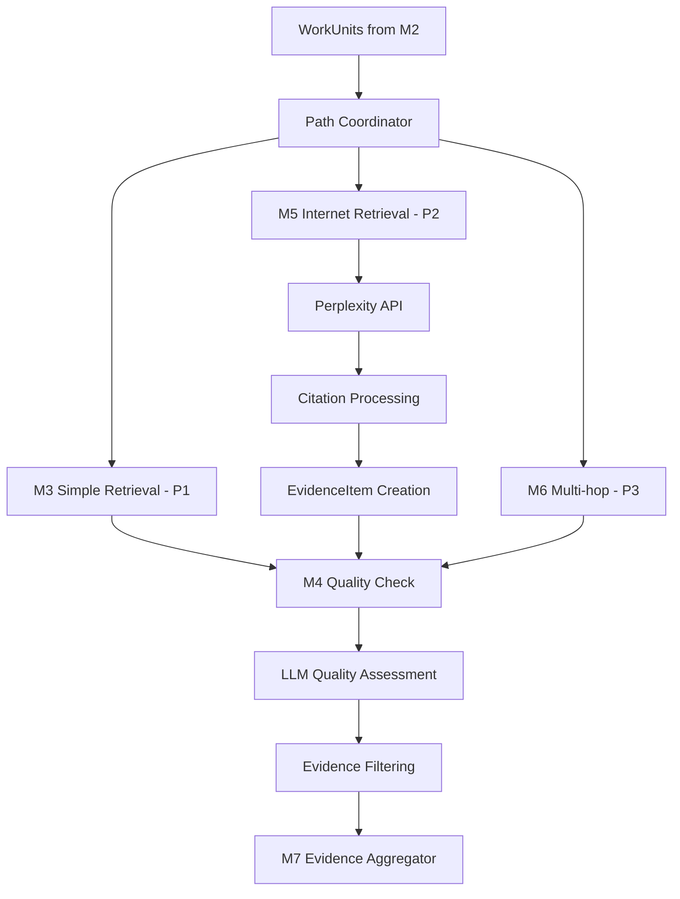

# Design Document

## Overview

This design implements M5 (Internet Retrieval) and M4 (Quality Check) modules for the QueryReactor system. M5 uses Perplexity API to retrieve current web information with built-in citations, while M4 uses LLM-based quality assessment to evaluate retrieved evidence. Both modules integrate with the existing QueryReactor architecture and load prompts from the centralized prompts.md file.

The design follows the established patterns in the codebase:
- Inherits from BaseModule and LLMModule base classes
- Uses the existing configuration and prompt loading system
- Integrates with ReactorState and EvidenceItem models
- Supports both actual API calls and placeholder responses for V1.0/V1.1 compatibility

## Architecture

### Module Hierarchy

```
BaseModule (abstract)
├── LLMModule (abstract)
│   └── M4QualityCheckLangGraph
└── RetrievalModule (abstract)
    └── M5InternetRetrievalLangGraph
```

### Data Flow



### Integration Points

1. **Path Coordinator Integration**: M5 is called by the path coordinator for P2 (Internet Retrieval) path
2. **Quality Check Integration**: M4 is integrated into the path coordinator to process evidence from each retrieval path (P1, P2, P3) immediately after retrieval
3. **Reusable Quality Assessment**: M4 acts as a quality gate after each retrieval path, ensuring consistent quality standards across all evidence sources
4. **Configuration System**: Both modules use config_loader for settings and prompts
5. **Model Management**: M4 uses model_manager for LLM selection and optimization

## Components and Interfaces

### M5 Internet Retrieval Module

**Class**: `M5InternetRetrievalLangGraph`
**Base Class**: `RetrievalModule`
**Path ID**: `P2`

#### Key Methods

```python
async def execute(self, state: ReactorState) -> ReactorState:
    """Main execution method following BaseModule interface"""

async def _search_perplexity(self, query: str) -> List[Dict[str, Any]]:
    """Perform Perplexity API search using chat completions endpoint"""

def _parse_perplexity_response(self, data: Dict[str, Any], query: str) -> List[Dict[str, Any]]:
    """Parse Perplexity API response into search result format"""

async def _create_evidence_items(self, search_results: List[Dict], workunit, user_id: UUID, conversation_id: UUID) -> List[EvidenceItem]:
    """Convert search results to EvidenceItem objects"""

async def _handle_rate_limiting(self, retry_count: int) -> None:
    """Handle API rate limiting with exponential backoff"""
```

#### Configuration Keys

- `PERPLEXITY_API_KEY`: Perplexity API key (from environment)
- `m5.model`: Perplexity model to use (default: "llama-3.1-sonar-small-128k-online")
- `m5.max_results`: Maximum search results to retrieve (default: 10)
- `m5.timeout_seconds`: Request timeout in seconds (default: 30)
- `m5.rate_limit_delay`: Base delay for rate limiting (default: 1.0 seconds)

### M4 Quality Check Module

**Class**: `M4QualityCheckLangGraph`
**Base Class**: `LLMModule`
**Model Config Key**: `m4.model`
**Usage Pattern**: Called after each retrieval path (P1, P2, P3) to ensure consistent quality filtering

#### Key Methods

```python
async def execute(self, state: ReactorState) -> ReactorState:
    """Main execution method following BaseModule interface"""

async def check_path_evidence_quality(self, state: ReactorState, path_id: str) -> ReactorState:
    """Check quality of evidence from a specific retrieval path"""

async def _assess_evidence_quality(self, evidence: EvidenceItem, original_query: str) -> QualityAssessment:
    """Use LLM to assess evidence quality and relevance"""

def _filter_evidence_by_quality(self, evidences: List[EvidenceItem], assessments: List[QualityAssessment]) -> List[EvidenceItem]:
    """Filter evidence based on quality scores"""

def _create_quality_metadata(self, assessment: QualityAssessment) -> Dict[str, Any]:
    """Create metadata for quality assessment results"""
```

#### Quality Assessment Model

```python
class QualityAssessment(BaseModel):
    evidence_id: UUID
    relevance_score: float = Field(ge=0.0, le=1.0)
    credibility_score: float = Field(ge=0.0, le=1.0)
    recency_score: float = Field(ge=0.0, le=1.0)
    completeness_score: float = Field(ge=0.0, le=1.0)
    overall_score: float = Field(ge=0.0, le=1.0)
    reasoning: str
    should_keep: bool
```

#### Configuration Keys

- `m4.model`: LLM model for quality assessment (default: task-optimized)
- `m4.quality_threshold`: Minimum quality score to keep evidence (default: 0.6)
- `m4.batch_size`: Number of evidence items to assess in parallel (default: 5)

### Prompt Loading System

Both modules load prompts from `prompts.md` using the existing `config_loader.get_prompt()` method.

#### Required Prompts

**M5 Prompts**: None (M5 is primarily API-based, no LLM calls)

**M4 Prompts**:
- `m4_quality_assessment`: Main prompt for evidence quality evaluation

#### Prompt Template Variables

The M4 quality assessment prompt supports these variables:
- `{original_query}`: The original user query
- `{evidence_content}`: The evidence content to assess
- `{evidence_source}`: The source URL or identifier
- `{evidence_title}`: The evidence title (if available)

## Data Models

### Perplexity API Response

```python
class PerplexitySearchResult(BaseModel):
    title: str
    snippet: str
    link: str
    displayLink: str
    formattedUrl: str
    citation_index: Optional[int] = None
    source_type: str = "perplexity"  # "citation" or "content_chunk"
```

### Perplexity Citation Processing

```python
class PerplexityCitation(BaseModel):
    title: str
    url: str
    text: str
    citation_index: int
    
class PerplexityResponse(BaseModel):
    content: str
    citations: List[PerplexityCitation]
    model: str
    usage: Optional[Dict[str, Any]] = None
```

### Quality Assessment Extensions

The existing `EvidenceItem` model will be extended with quality metadata:

```python
# Added to EvidenceItem.provenance or as separate metadata
quality_metadata: Optional[Dict[str, Any]] = {
    "quality_score": float,
    "quality_reasoning": str,
    "assessment_timestamp": EpochMs,
    "assessor_model": str
}
```

## Error Handling

### M5 Error Scenarios

1. **API Key Missing/Invalid**
   - Fallback: Log warning and use placeholder search results
   - User Impact: Returns mock data instead of real search results

2. **Rate Limiting (429 Status)**
   - Retry with exponential backoff (max 1 retry)
   - Fallback: Use placeholder results if retry fails

3. **Network/API Failures**
   - Timeout: 30 seconds per request
   - Fallback: Use placeholder search results with realistic structure

4. **Response Parsing Failures**
   - Fallback: Create evidence items from raw response content
   - Continue processing with warning logs

### M4 Error Scenarios

1. **LLM API Failures**
   - Fallback: Use heuristic scoring based on source credibility and content length
   - Continue processing with warning logs

2. **Invalid Quality Scores**
   - Validation: Ensure scores are between 0.0 and 1.0
   - Fallback: Use default score of 0.5 for invalid responses

3. **Prompt Loading Failures**
   - Fallback: Use hardcoded default prompt
   - Log warning about missing prompt configuration

## Testing Strategy

### Unit Tests

**M5 Tests** (`tests/modules/test_m5_internet_retrieval_langgraph.py`):
- Perplexity API integration
- Citation parsing functionality
- Rate limiting and retry logic
- Evidence item creation
- Error handling scenarios

**M4 Tests** (`tests/modules/test_m4_retrieval_quality_check_langgraph.py`):
- LLM quality assessment
- Evidence filtering logic
- Prompt loading and template substitution
- Quality score validation
- Batch processing

### Integration Tests

**End-to-End Tests** (`tests/integration/test_m5_m4_integration.py`):
- Complete workflow from WorkUnit to filtered evidence
- Integration with path coordinator
- State management and evidence aggregation
- Performance under load

### Mock Testing

For V1.0 compatibility, both modules support mock/placeholder modes:
- M5: Returns dummy search results with realistic structure
- M4: Returns placeholder quality assessments
- Controlled by `llm.use_actual_calls` configuration

### Path Coordinator Integration Pattern

The M4 quality check will be integrated into the path coordinator's `_execute_single_path` method:

```python
async def _execute_single_path(self, plan: PathExecutionPlan, path_state: ReactorState) -> PathExecutionResult:
    """Execute single path with integrated quality check"""
    
    # 1. Execute retrieval path (M3, M5, or M6)
    if plan.path_id == "P1":
        result_state = await simple_retrieval_langgraph.execute(path_state)
    elif plan.path_id == "P2":
        result_state = await m5_internet_retrieval.execute(path_state)
    elif plan.path_id == "P3":
        result_state = await m6_multihop.execute(path_state)
    
    # 2. Apply quality check to evidence from this path
    quality_checked_state = await m4_quality_check.check_path_evidence_quality(result_state, plan.path_id)
    
    # 3. Return results with quality-filtered evidence
    return self._create_path_result(quality_checked_state, plan)
```

This ensures that:
- Each retrieval path's evidence is quality-checked immediately
- M4 is reused consistently across all paths
- Quality standards are applied uniformly
- Low-quality evidence is filtered before aggregation

## Performance Considerations

### M5 Performance

1. **Parallel Processing**: Process multiple WorkUnits concurrently
2. **Content Extraction Optimization**: 
   - Skip extraction for low-priority results
   - Use async HTTP client with connection pooling
   - Implement content length limits (max 10KB per page)

3. **Caching Strategy**: 
   - Cache search results for identical queries (1 hour TTL)
   - Cache extracted content for URLs (24 hour TTL)

### M4 Performance (Reusable Across Paths)

1. **Batch Processing**: Assess multiple evidence items in parallel
2. **Model Optimization**: Use task-optimized model parameters for fast assessment
3. **Path-Aware Processing**: Track which path evidence came from for better assessment
4. **Early Termination**: Skip assessment for obviously low-quality evidence

### Resource Limits

- **M5**: Max 10 search results per WorkUnit, max 5 concurrent searches
- **M4**: Max 20 evidence items per batch, max 3 concurrent LLM calls
- **Memory**: Limit content extraction to 10KB per page
- **Timeouts**: 30s for search, 15s for content extraction, 10s for LLM calls

## Security Considerations

### API Key Management

- Perplexity API key loaded from environment variables
- No API keys logged or exposed in error messages
- Secure handling of API responses and citations

### Content Safety

- Citation URL validation and sanitization
- Content filtering through Perplexity's built-in safety measures
- Rate limiting to prevent API abuse

### Data Privacy

- No storage of search queries or results beyond session scope
- Anonymization of user data in logs
- Compliance with Perplexity API terms of service

## Deployment Configuration

### Environment Variables

```bash
# Required for M5
PERPLEXITY_API_KEY=your_perplexity_api_key_here

# Optional configuration
M5_MAX_RESULTS=10
M5_TIMEOUT_SECONDS=30
M4_QUALITY_THRESHOLD=0.6
M4_BATCH_SIZE=5
```

### Configuration File Updates

Add to `config.md`:
```
# M5 Internet Retrieval Configuration
m5.model = llama-3.1-sonar-small-128k-online
m5.max_results = 10
m5.rate_limit_delay = 1.0
m5.timeout_seconds = 30

# M4 Quality Check Configuration  
m4.model = gpt-5-nano-2025-08-07
m4.quality_threshold = 0.6
m4.batch_size = 5
m4.timeout_seconds = 10
```

### Prompt Updates

Add to `prompts.md`:
```markdown
## m4_quality_assessment
You are an evidence quality assessor. Evaluate the relevance, credibility, recency, and completeness of the provided evidence for answering the given query.

Original Query: {original_query}
Evidence Source: {evidence_source}
Evidence Title: {evidence_title}
Evidence Content: {evidence_content}

Assess the evidence on these dimensions (0.0 to 1.0):
- Relevance: How well does this evidence address the query?
- Credibility: How trustworthy is the source and content?
- Recency: How current is the information?
- Completeness: How comprehensive is the information?

Provide your assessment as a JSON object with scores and reasoning.
```